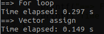

# Timing Your C++ Code

## Tools From the Standard Library

See the [original article](<https://www.pluralsight.com/blog/software-development/how-to-measure-execution-time-intervals-in-c-->) for more details.

You could use the `high_resolution_clock` class from the `<chrono>` header. Sample code:

```c++
#include <chrono>
#include <vector>
#include <cstdio>
using namespace std;

constexpr int MAXN = 1e8;
vector<int> v(MAXN);

void test_for_loop(){
    auto start = chrono::high_resolution_clock::now();
    for(int i = 0; i < v.size(); i++)
        v[i] = 100;
    auto finish = chrono::high_resolution_clock::now();
    chrono::duration<double> elapsed = finish - start;
    printf("==> For loop\n");
    printf("Time elapsed: %.3f s\n", elapsed.count());
}

void test_vector_assign(){
    auto start = chrono::high_resolution_clock::now();
    v.assign(v.size(), 100);
    auto finish = chrono::high_resolution_clock::now();
    chrono::duration<double> elapsed = finish - start;
    printf("==> Vector assign\n");
    printf("Time elapsed: %.3f s\n", elapsed.count());
}

int main(){
    test_for_loop();
    test_vector_assign();
}
```

In my computer, the "vector assign" version actually runs 2 times faster. Try it on your computer :smiley:.



**Takeaways**

- You do not directly construct the instance of `high_resolution_clock` class. Instead you call the **`now()`** static method.
- Call `now()` at the beginning and end of your code, then construct a **`duration<double>`** to get the **seconds** elapsed.